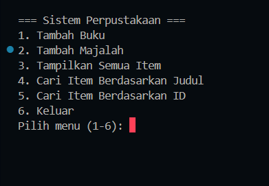
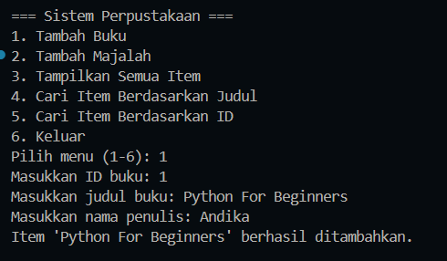
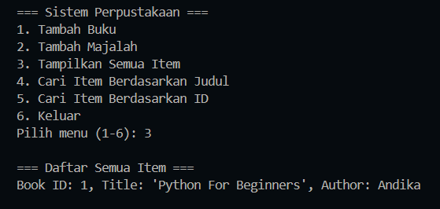
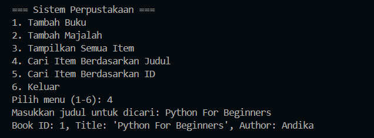

# Sistem Manajemen Perpustakaan Sederhana

## Deskripsi Program

Program ini merupakan **Sistem Manajemen Perpustakaan Sederhana** menggunakan **Python** dengan konsep **Object-Oriented Programming (OOP)**.

Fitur utama:

- Menambahkan buku (`Book`) atau majalah (`Magazine`) ke perpustakaan.
- Menampilkan semua item yang tersedia.
- Mencari item berdasarkan **judul** atau **ID**.
- Interaktif: user dapat menggunakan sistem melalui menu input.

Program ini menerapkan konsep OOP berikut:

- **Class & Inheritance:** `LibraryItem` sebagai abstract class; `Book` dan `Magazine` sebagai subclass.
- **Encapsulation:** atribut penting menggunakan **private (`__`)** dan **protected (`_`)**.
- **Polymorphism:** method `display_info()` diimplementasikan berbeda pada masing-masing subclass.
- **Property Decorator:** untuk mengakses atribut `title`, `author`, dan `issue_number`.

---

## Fitur Program

1. **Tambah Item**
   - User dapat menambahkan buku atau majalah secara interaktif.
2. **Tampilkan Semua Item**
   - Menampilkan seluruh koleksi perpustakaan beserta detailnya.
3. **Cari Item Berdasarkan Judul**
   - Pencarian judul bersifat **case-insensitive**.
4. **Cari Item Berdasarkan ID**
   - Pencarian berdasarkan ID unik setiap item.
5. **Menu Interaktif**
   - User memilih aksi melalui menu input.

---

## Contoh Penggunaan Program

**Menambahkan Item & Menampilkan Item**

```text
=== Sistem Perpustakaan ===
1. Tambah Buku
2. Tambah Majalah
3. Tampilkan Semua Item
4. Cari Item Berdasarkan Judul
5. Cari Item Berdasarkan ID
6. Keluar
Pilih menu (1-6): 1
Masukkan ID buku: 1
Masukkan judul buku: Python for Beginners
Masukkan nama penulis: Andika Rahman Pratama
Item 'Python for Beginners' berhasil ditambahkan.

Pilih menu (1-6): 2
Masukkan ID majalah: 101
Masukkan judul majalah: Technology
Masukkan nomor edisi: 45
Item 'Tech Today' berhasil ditambahkan.

Pilih menu (1-6): 3

=== Daftar Semua Item ===
Book ID: 1, Title: 'Python for Beginners', Author: Andika Rahman Pratama
Magazine ID: 101, Title: 'Tech Today', Issue No: 45

Pilih menu (1-6): 4
Masukkan judul untuk dicari: Python
Book ID: 1, Title: 'Python for Beginners', Author: Andika Rahman Pratama

Pilih menu (1-6): 5
Masukkan ID untuk dicari: 101
Magazine ID: 101, Title: 'Tech Today', Issue No: 45
```

---

## Screenshot Penggunaan

### Menu Interaktif



### Menambahkan Item



### Menampilkan Semua Item



### Mencari Item



---

## Diagram Class

          LibraryItem (Abstract)
           /                \
        Book                Magazine
      - author             - issue_number
      + display_info()     + display_info()

               |
             Library
      - __items (private)
      + add_item()
      + show_items()
      + find_by_title()
      + find_by_id()

```

```
